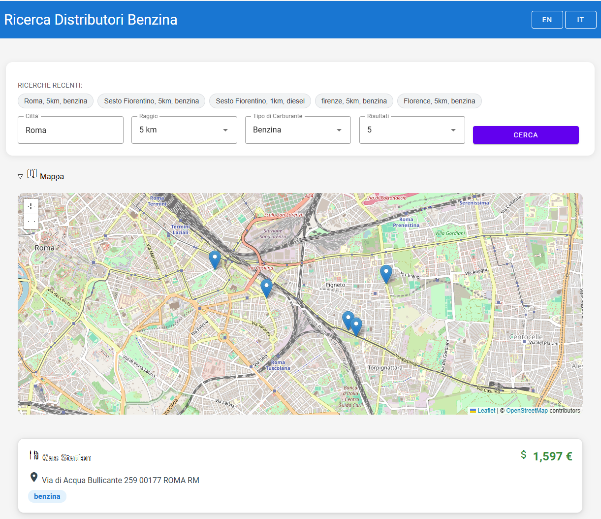

# BenzoApp

[](https://www.python.org/)
[](LICENSE)

BenzoApp is a FastAPI-based web application for finding gas stations. It provides an API to search for gas stations near a city within a given radius, with support for multiple fuel types. The frontend is built with static HTML, CSS, and JavaScript, with internationalization support.

---

## Table of Contents

- [BenzoApp](#benzoapp)
  - [Table of Contents](#table-of-contents)
  - [Features](#features)
  - [Screenshots](#screenshots)
  - [Project Structure](#project-structure)
  - [Dependencies](#dependencies)
    - [Production Dependencies](#production-dependencies)
    - [Development Dependencies](#development-dependencies)
  - [Setup](#setup)
  - [Usage](#usage)
  - [API Reference](#api-reference)
    - [`POST /search`](#post-search)
    - [`GET /`](#get-)
    - [`GET /health`](#get-health)
  - [Development Workflow](#development-workflow)
  - [Common Commands](#common-commands)
    - [Running the Application](#running-the-application)
    - [Testing](#testing)
    - [Linting](#linting)
    - [Type Checking](#type-checking)
  - [Running Tests](#running-tests)
  - [Contributing](#contributing)
  - [License](#license)
  - [Contact](#contact)
  - [Acknowledgments](#acknowledgments)

---

## Features

- 🚀 FastAPI backend for high performance and easy extensibility
- 🌐 Static web frontend (HTML, CSS, JS) for user-friendly interaction
- 🔍 Search gas stations by city, radius, and fuel type
- 📊 View and compare fuel prices
- 🌍 Internationalization support (English, Italian)
- 🧪 Automated tests for reliability
- 🛠️ Simple setup with uv package manager
- 📦 Modern Python 3.13.* codebase with type hints

---

## Screenshots



---

## Project Structure

```text
BenzoApp/
├── .github/                  # GitHub workflows and issue templates
├── .roo/                     # Roo AI assistant configuration
├── .vscode/                  # VS Code settings
├── docs/                     # Project documentation
│   └── frontend-code-review.md
├── src/                      # Source code
│   ├── main.py               # FastAPI application entry point
│   ├── models.py             # Pydantic models for data validation
│   └── static/               # Static assets (HTML, CSS, JS, images)
│       ├── css/
│       ├── data/             # Static data files (e.g., cities.json)
│       ├── js/               # JavaScript files
│       ├── locales/          # Internationalization files
│       └── templates/        # HTML templates
├── tests/                    # Test files
│   ├── __init__.py
│   └── test_main.py
├── .env.example              # Environment variables example
├── .gitignore                # Git ignore rules
├── .mypy.ini                 # MyPy configuration
├── .pytest.ini               # PyTest configuration
├── .rooignore                # Roo ignore rules
├── .ruff.toml                # Ruff configuration
├── .uv.toml                  # uv configuration
├── agent.md                  # Agent documentation
├── frontend_analysis_report.md
├── git_diff.bat              # Windows batch script for generating git diff
├── init_instruction.sh       # Shell script for initializing project instructions
├── PRD.md                    # Product Requirements Document
├── PROJECT_DOC.md            # Project documentation
├── pyproject.toml            # Python project configuration
├── README.md                 # Project README
├── run.bat                   # Windows batch script to run the application
├── screenshot.png            # Screenshot image
├── TODOLIST.md               # Todo list
├── uv.lock                   # uv lock file
└── README.md                 # Project README
```

---

## Dependencies

### Production Dependencies

- `cachetools`: 6.1.0 - In-memory caching
- `fastapi[standard]`: 0.116.1 - Web framework
- `httptools`: 0.6.4 - HTTP protocol tools
- `humanize`: 4.12.3 - Human-readable formatting
- `loguru`: 0.7.3 - Logging
- `orjson`: 3.11.1 - Fast JSON parser
- `pathvalidate`: 3.3.1 - Path validation
- `pydantic_settings`: 2.7.1 - Settings management
- `pydantic`: 2.9.2 - Data validation
- `python-dateutil`: 2.9.0.post0 - Date utilities
- `python-dotenv`: 1.1.0 - Environment variables
- `python-multipart`: 0.0.9 - Multipart form data parsing
- `tabulate`: 0.9.0 - Tabular data formatting
- `tzdata`: 2025.2 - Timezone data
- `uvicorn[standard]`: 0.32.1 - ASGI server
- `wrapt`: 1.17.2 - Decorator library
- `tenacity`: 9.0.0 - Retry mechanism

### Development Dependencies

- `datamodel-code-generator`: 0.32.0 - Generate Pydantic models from JSON Schema
- `httpx`: 0.28.1 - HTTP client for testing
- `ipykernel`: 6.30.0 - IPython kernel
- `mypy`: 1.17.0 - Static type checker
- `pip-audit`: 2.9.0 - Security vulnerability scanning
- `pip`: 25.1.1 - Package installer
- `pipgrip`: 0.8.0 - Dependency resolver
- `pytest-cov`: 5.0.0 - Test coverage
- `pytest-env`: 0.8.2 - Environment variables in tests
- `pytest-randomly`: 3.17.0 - Randomize test order
- `pytest-sugar`: 0.9.7 - Pretty test output
- `pytest-xdist`: 3.6.1 - Parallel test execution
- `pytest`: 8.3.4 - Testing framework
- `ruff`: 0.6.8 - Code linter and formatter
- `types-cachetools`: 5.3.0.20241125 - Type stubs
- `types-python-dateutil`: 2.9.0.20241125 - Type stubs
- `types-tabulate`: 0.9.0.20241125 - Type stubs
- `watchfiles`: 0.22.0 - File watching

---

## Setup

1. **Clone the repository:**

   ```text
   git clone https://github.com/yourusername/BenzoApp.git
   cd BenzoApp
   ```

2. **Create and activate virtual environment:**

   ```sh
   # Create virtual environment
   uv venv
   
   # Activate virtual environment
   # On Windows:
   .\.venv\Scripts\activate
   
   # On Unix-like systems:
   source .venv/bin/activate
   ```

3. **Install dependencies:**

   ```sh
   uv pip install -e .
   ```

4. **Run the application:**

   ```text
   # On Windows
   .\run.bat
   
   # On Unix-like systems or directly with uv
   uv run uvicorn src.main:app --reload
   ```

---

## Usage

1. Open your browser and navigate to [http://127.0.0.1:8000](http://127.0.0.1:8000).
2. Use the search form to find gas stations by city, radius, fuel type and results number.
3. View results and compare fuel prices.

---

## API Reference

### `POST /search`

Search for gas stations near a city.

**Request Body:**

```json
{
  "city": "Rome",
  "radius": 10,
  "fuel": "diesel",
  "results": 5
}
```

**Response:**

```json
{
  "stations": [
    {
      "id": "123",
      "address": "Via Roma 1",
      "latitude": 41.9028,
      "longitude": 12.4964,
      "fuel_prices": [
        {
          "type": "diesel",
          "price": 1.799
        }
      ]
    }
  ],
  "warning": null
}
```

### `GET /`

Returns the main HTML page.

### `GET /health`

Health check endpoint. Returns `{"status": "ok"}`.

---

## Development Workflow

1. Create and activate virtual environment: `uv venv && uv activate`
2. Install dependencies: `uv pip install -e .`
3. Run tests: `uv run pytest`
4. Check code style: `ruff check .`
5. Check types: `mypy .`
6. Run application: `uv run uvicorn src.main:app --reload`

---

## Common Commands

### Running the Application

```bash
# Windows
uv run uvicorn src.main:app --reload

# Alternative using run.bat
run.bat
```

### Testing

```bash
uv run pytest
uv run pytest --cov=src  # With coverage
```

### Linting

```bash
ruff check .
ruff format .
```

### Type Checking

```bash
mypy .
```

---

## Running Tests

```text
uv run pytest
```

For test coverage:

```text
uv run pytest --cov=src
```

---

## Contributing

Contributions are welcome! Please open issues or pull requests for improvements, bug fixes, or new features.

1. Fork the repository
2. Create a new branch (`git checkout -b feature/your-feature`)
3. Commit your changes
4. Push to your fork and submit a pull request

---

## License

This project is licensed under the MIT License.

---

## Contact

For questions or support, please open an issue on GitHub or contact the maintainer.

---

## Acknowledgments

- [FastAPI](https://fastapi.tiangolo.com/)
- [Loguru](https://github.com/Delgan/loguru)
- [httpx](https://www.python-httpx.org/)
- [OpenStreetMap Nominatim](https://nominatim.openstreetmap.org/)
- [Prezzi Carburante API](https://prezzi-carburante.onrender.com/)