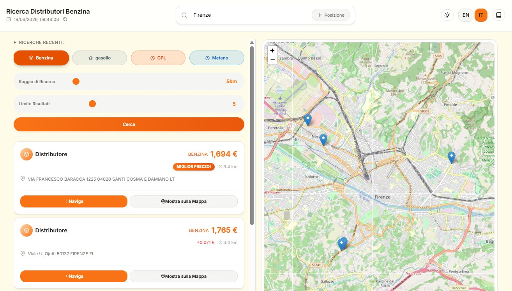

# BenzoApp 🚗⛽

> A modern web application for finding and comparing gas station fuel prices in Italy

[](https://www.python.org/) [](https://fastapi.tiangolo.com/) [](https://opensource.org/licenses/MIT) [](https://github.com/astral-sh/ruff)

---

<p align="center">
  
  <br />
  <em>Figure 1: The main interface of BenzoApp showing the search input, filters, and interactive map</em>
</p>

---

BenzoApp is a fast, user-friendly web application that helps users find and compare fuel prices at gas stations across Italy. Leveraging real-time data from official CSV datasets and geocoding services from OpenStreetMap, BenzoApp provides an intuitive interface with interactive maps and smart filtering options.

## ✨ Features

- 🌍 **City-based Search** - Find gas stations near any Italian city using geocoding
- 💰 **Price Comparison** - Compare fuel prices across multiple stations with difference indicators
- 🗺️ **Interactive Map** - Visualize station locations on an interactive map powered by Leaflet
- 📍 **Location Services** - Navigate to stations, current location detection, or view them on the map
- 🔍 **Smart Filtering** - Filter by fuel type (Benzina, Gasolio, GPL, Metano) with auto-search
- 📏 **Radius Control** - Adjustable search radius (1-200 km)
- 🌐 **Multi-language** - Support for Italian and English (i18n with i18next)
- 📱 **Responsive Design** - Works seamlessly on desktop and mobile devices
- ⚡ **Fast & Efficient** - Async operations with connection pooling and local caching
- 🎨 **Modern UI** - Clean, accessible interface with Alpine.js, resizable layout
- 🔄 **Data Management** - CSV data status indicator with manual reload capability
- 📊 **Recent Searches** - Quick access to previous searches

## 🏗️ Architecture

BenzoApp is built with a modern, scalable architecture:

### Backend

- **FastAPI** - High-performance async Python web framework
- **Pydantic** - Data validation and settings management
- **httpx** - Async HTTP client with connection pooling
- **Tenacity** - Intelligent retry logic for external API calls
- **Loguru** - Structured logging

### Frontend

- **Alpine.js** - Lightweight reactive framework
- **Leaflet** - Interactive mapping library
- **i18next** - Internationalization framework
- **Modern CSS** - Custom design system with Inter font

### External Services

- **OpenStreetMap Nominatim** - Geocoding city names to coordinates
- **MIMIT — Carburanti (open data CSV)** - Official CSV datasets for fuel prices and station registry (Italian Ministry of Enterprises and Made in Italy). Data is downloaded directly and cached locally.

## 🚀 Quick Start

### Prerequisites

- Python 3.14 or higher
- [uv](https://github.com/astral-sh/uv) - Fast Python package installer and manager

### Installation

1. **Clone the repository**

   ```bash
   git clone https://github.com/yourusername/BenzoApp.git
   cd BenzoApp
   ```

2. **Install uv** (if not already installed)

   ```bash
   # On Windows (PowerShell)
   powershell -c "irm https://astral.sh/uv/install.ps1 | iex"

   # On macOS/Linux
   curl -LsSf https://astral.sh/uv/install.sh | sh
   ```

3. **Create virtual environment and install dependencies**

   ```bash
   uv sync
   ```

4. **Configure environment variables**

   ```bash
   # Copy example environment file
   cp .env.example .env

   # Edit .env with your settings (optional - defaults work for development)
   ```

5. **Run the application**

   ```bash
   uv run _main.py
   ```

6. **Open your browser**

   ```text
   Navigate to http://127.0.0.1:8000
   ```

## 🔧 Configuration

The application uses environment variables for configuration. See [.env.example](.env.example) for all available options:

| Variable                    | Description                                  | Default                                                   |
|-----------------------------|----------------------------------------------|-----------------------------------------------------------|
| `NOMINATIM_API_URL`         | OpenStreetMap geocoding API endpoint         | `https://nominatim.openstreetmap.org/search`              |
| `PREZZI_CARBURANTE_CSV_URL` | Fuel price CSV download URL                  | `https://www.mimit.gov.it/it/open-data/elenco-dataset/carburanti-prezzi-praticati-e-anagrafica-degli-impianti` |
| `CORS_ALLOWED_ORIGINS`      | Comma-separated list of allowed CORS origins | `http://localhost:3000,http://127.0.0.1:3000`              |
| `USER_AGENT`                | Custom user agent for external API requests  | `GasStationFinder/1.0 (contact@example.com)`              |

## 📚 API Documentation

Once the application is running, interactive API documentation is available at:

- **Swagger UI**: <http://127.0.0.1:8000/docs>
- **ReDoc**: <http://127.0.0.1:8000/redoc>

### Main Endpoints

#### `POST /search`

Search for gas stations near a city.

**Request Body:**

```json
{
  "city": "Milano",
  "radius": 10,
  "fuel": "benzina",
  "results": 5
}
```

**Response:**

```json
{
  "stations": [
    {
      "id": "0",
      "address": "Via Roma 123, Milano",
      "latitude": 45.4642,
      "longitude": 9.1900,
      "fuel_prices": [
        {
          "type": "benzina",
          "price": 1.899
        }
      ]
    }
  ],
  "warning": null,
  "error": false
}
```

#### `GET /health`

Health check endpoint.

**Response:**

```json
{
  "status": "ok"
}
```

#### `GET /api/csv-status`

Returns CSV data freshness and source information.

**Response:**

```json
{
  "csv_status": {
    "last_updated": "2026-02-12T10:00:00Z",
    "source": "https://www.mimit.gov.it/...",
    "cache_age_hours": 2
  }
}
```

#### `POST /api/reload-csv`

Forces CSV download and cache refresh.

**Response:**

```json
{
  "message": "CSV reload started",
  "status": "in_progress"
}
```

## 🛠️ Development

### Code Quality Tools

The project uses modern Python tooling:

- **ruff** - Lightning-fast linting and formatting
- **ty** - Type checking
- **biome** - JavaScript/CSS/HTML linting and formatting
- **pytest** - Testing framework

### Running Tests

```bash
# Run all tests
uv run pytest tests/

# Run with coverage
uv run pytest tests/ --cov=src --cov-report=html
```

### Code Formatting & Linting

```bash
# Python
ruff check .
ruff check . --fix

# Frontend
biome check src/static
biome check src/static --write
```

### Type Checking

```bash
ty check .
```

## 📁 Project Structure

```text
BenzoApp/
├── src/
│   ├── main.py                 # FastAPI application
│   ├── models.py               # Pydantic models
│   ├── services/               # Business logic
│   │   ├── fuel_api.py         # Fuel price CSV integration
│   │   ├── fuel_type_utils.py
│   │   ├── geocoding.py        # Geocoding service
│   │   ├── prezzi_csv.py       # CSV facade + combination
│   │   ├── csv_cache.py        # JSON cache read/write/freshness
│   │   ├── csv_fetcher.py      # CSV download and file management
│   │   ├── csv_parser.py       # CSV parsing and record merging
│   │   ├── csv_utils.py        # CSV utility functions
│   │   ├── distance_utils.py   # Haversine distance calculation
│   │   └── static/             # Service-local static data
│   └── static/                 # Frontend assets
│       ├── css/
│       ├── js/
│       ├── locales/            # i18n translations
│       ├── templates/          # HTML templates
│       └── data/               # Cached CSV/JSON data
├── tests/                      # Test suite
├── docs/                       # Documentation
├── data/                       # Cached CSV data
├── pyproject.toml              # Project metadata & dependencies
├── .env.example                # Environment variables template
└── README.md
```

## 🤝 Contributing

Contributions are welcome! Please read [CONTRIBUTING.md](CONTRIBUTING.md) for details on our code of conduct and the process for submitting pull requests.

## 📄 License

This project is licensed under the MIT License - see the [LICENSE](LICENSE) file for details.

## 🙏 Acknowledgments

- [OpenStreetMap](https://www.openstreetmap.org/) for geocoding services
- [MIMIT — Carburanti (open data)](https://www.mimit.gov.it/it/open-data/elenco-dataset/carburanti-prezzi-praticati-e-anagrafica-degli-impianti) — Official open dataset for fuel prices and station registry (Italian Ministry of Enterprises and Made in Italy)
- [FastAPI](https://fastapi.tiangolo.com/) for the amazing web framework
- [Leaflet](https://leafletjs.com/) for interactive maps
- [Alpine.js](https://alpinejs.dev/) for reactive frontend components
- [Bun](https://bun.sh/) for fast JavaScript tooling

## 📧 Support

For issues, questions, or suggestions, please [open an issue](https://github.com/yourusername/BenzoApp/issues) on GitHub.

---

**Made with ❤️ for the Italian fuel consumer community**
