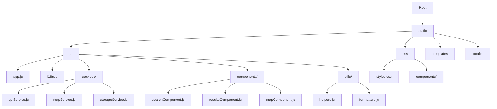

# Frontend Code Review and Improvement Recommendations

## Overview

This document provides a comprehensive review of the Gas Station Finder frontend application with detailed suggestions for improvements in code organization, component structure, state management patterns, performance optimizations, accessibility enhancements, and best practices implementation.

## Current Architecture

The Gas Station Finder frontend is built using:
- Alpine.js for reactivity
- Material Design Components for UI elements
- Leaflet for mapping functionality
- i18next for internationalization

The application consists of HTML templates, CSS stylesheets, JavaScript files, and localization resources.

## Recommended File Structure



## 1. Code Organization and Structure

### Current Issues
- All JavaScript logic is contained in a single `app.js` file
- No clear separation of concerns
- Limited modularity and reusability

### Recommended Changes

#### Create a Modular JavaScript Architecture

**1. Create `services/apiService.js`**

```javascript
// services/apiService.js
/**
 * Service for handling API calls to the backend
 */
const apiService = {
  /**
   * Search for gas stations
   * @param {Object} searchData - Search parameters
   * @returns {Promise<Object>} - Search results
   */
  async searchGasStations(searchData) {
    const fuelToSend = searchData.fuel === 'diesel' ? 'gasolio' : searchData.fuel;

    try {
      const response = await fetch('/search', {
        method: 'POST',
        headers: { 'Content-Type': 'application/json' },
        body: JSON.stringify({
          city: searchData.city,
          radius: parseInt(searchData.radius),
          fuel: fuelToSend,
          results: parseInt(searchData.results)
        })
      });

      if (!response.ok) {
        const errorData = await response.json().catch(() => ({}));
        throw new Error(errorData.detail || `HTTP error! status: ${response.status}`);
      }

      return await response.json();
    } catch (error) {
      console.error('API call failed:', error);
      throw error;
    }
  }
};

export default apiService;
```

**2. Create `services/mapService.js`**

```javascript
// services/mapService.js
/**
 * Service for handling map functionality
 */
const mapService = {
  map: null,
  mapInitialized: false,
  mapMarkers: [],

  /**
   * Initialize the map
   * @param {string} containerId - ID of the map container
   * @param {Array} initialView - [lat, lng, zoom] for initial view
   */
  initMap(containerId, initialView = [41.9028, 12.4964, 6]) {
    if (this.mapInitialized) return;

    const mapContainer = document.getElementById(containerId);
    if (!mapContainer) {
      console.warn('Map container not found');
      return;
    }

    this.map = L.map(containerId).setView([initialView[0], initialView[1]], initialView[2]);
    L.tileLayer('https://{s}.tile.openstreetmap.org/{z}/{x}/{y}.png', {
      attribution: '&copy; <a href="https://www.openstreetmap.org/copyright">OpenStreetMap</a> contributors'
    }).addTo(this.map);

    this.mapInitialized = true;

    // Handle map resize when container becomes visible
    setTimeout(() => {
      if (this.map) {
        this.map.invalidateSize();
      }
    }, 100);
  },

  /**
   * Update map with station markers
   * @param {Array} stations - Array of station objects
   */
  updateMap(stations) {
    if (!this.mapInitialized) {
      this.initMap('map');
    }

    if (!this.map) {
      console.warn('Map not initialized, cannot update');
      return;
    }

    // Clear existing markers
    this.clearMarkers();

    // Add new markers if we have results
    if (stations.length > 0) {
      const bounds = [];
      stations.forEach(station => {
        if (station.latitude && station.longitude) {
          const marker = L.marker([station.latitude, station.longitude])
            .addTo(this.map)
            .bindPopup(`<b>${station.gestore || 'Gas Station'}</b><br>${station.address}`);
          this.mapMarkers.push(marker);
          bounds.push([station.latitude, station.longitude]);
        }
      });

      if (bounds.length > 0) {
        this.map.invalidateSize();
        this.map.fitBounds(bounds, { padding: [50, 50], maxZoom: 14 });
      }
    }
  },

  /**
   * Clear all markers from the map
   */
  clearMarkers() {
    if (this.mapMarkers && this.mapMarkers.length > 0) {
      this.mapMarkers.forEach(marker => marker.remove());
      this.mapMarkers = [];
    }
  }
};

export default mapService;
```

**3. Create `services/storageService.js`**

```javascript
// services/storageService.js
/**
 * Service for handling local storage operations
 */
const storageService = {
  /**
   * Get item from localStorage
   * @param {string} key - Storage key
   * @returns {any} - Parsed item or null if not found
   */
  getItem(key) {
    try {
      const item = localStorage.getItem(key);
      return item ? JSON.parse(item) : null;
    } catch (error) {
      console.error(`Error getting item from localStorage: ${error}`);
      return null;
    }
  },

  /**
   * Set item in localStorage
   * @param {string} key - Storage key
   * @param {any} value - Value to store
   */
  setItem(key, value) {
    try {
      localStorage.setItem(key, JSON.stringify(value));
    } catch (error) {
      console.error(`Error setting item in localStorage: ${error}`);
    }
  },

  /**
   * Remove item from localStorage
   * @param {string} key - Storage key
   */
  removeItem(key) {
    try {
      localStorage.removeItem(key);
    } catch (error) {
      console.error(`Error removing item from localStorage: ${error}`);
    }
  }
};

export default storageService;
```

**4. Create `utils/formatters.js`**

```javascript
// utils/formatters.js
/**
 * Utility functions for formatting data
 */
const formatters = {
  /**
   * Format currency value
   * @param {number} value - Currency value
   * @param {string} currency - Currency code (default: EUR)
   * @returns {string} - Formatted currency string
   */
  formatCurrency(value, currency = 'EUR') {
    return new Intl.NumberFormat('it-IT', {
      style: 'currency',
      currency: currency,
      minimumFractionDigits: 3,
      maximumFractionDigits: 3
    }).format(value);
  },

  /**
   * Format distance value
   * @param {number} value - Distance value
   * @param {string} unit - Distance unit (default: km)
   * @returns {string} - Formatted distance string
   */
  formatDistance(value, unit = 'km') {
    return `${value} ${unit}`;
  }
};

export default formatters;
```

**5. Refactor `app.js` to use the new modular structure**

```diff
--- a/src/static/js/app.js
+++ b/src/static/js/app.js
@@ -1,271 +1,107 @@
-// Extracts the 'gestore' (manager/operator) from a station object
-function extractGestore(station) {
-    return station.gestore || '';
-}
+import apiService from './services/apiService.js';
+import mapService from './services/mapService.js';
+import storageService from './services/storageService.js';
+import formatters from './utils/formatters.js';

 function gasStationApp() {
     return {
         formData: {
             city: '',
             radius: '5',
             fuel: 'benzina',
             results: '5'
         },
         recentSearches: [],
         loading: false,
         results: [],
         error: '',
         searched: false,
         linearProgress: null,
-        map: null,
-        mapInitialized: false,
-        mapMarkers: [],
         showCitySuggestions: false,
         cityList: [
             'Rome', 'Milan', 'Naples', 'Turin', 'Palermo', 'Genoa', 'Bologna',
             'Florence', 'Bari', 'Catania', 'Venice', 'Verona', 'Messina', 'Padua',
             'Trieste', 'Taranto', 'Brescia', 'Prato', 'Parma', 'Modena'
         ],
         filteredCities: [],

-        formatCurrency(value) {
-            return new Intl.NumberFormat('it-IT', {
-                style: 'currency',
-                currency: 'EUR',
-                minimumFractionDigits: 3,
-                maximumFractionDigits: 3
-            }).format(value);
-        },
-
         async init() {
             // Load all HTML templates first
             await Promise.all([
                 this.loadComponent('/static/templates/header.html', 'header-container'),
                 this.loadComponent('/static/templates/search.html', 'search-container'),
                 this.loadComponent('/static/templates/results.html', 'results-container')
             ]);

             // Load recent searches and set last city if available
             this.loadRecentSearches();
             if (this.recentSearches.length > 0 && this.recentSearches[0].city) {
                 this.formData.city = this.recentSearches[0].city;
             }

             // Use $nextTick to ensure the DOM is updated before initializing MDC/Leaflet
             this.$nextTick(() => {
                 this.initializeComponents();
             });
         },

         initializeComponents() {
             document.querySelectorAll('.mdc-text-field').forEach(el =>
                 mdc.textField.MDCTextField.attachTo(el));

             document.querySelectorAll('.mdc-select').forEach(el => {
                 const select = mdc.select.MDCSelect.attachTo(el);
                 select.listen('MDCSelect:change', () => {
                     const hiddenInput = el.querySelector('input[type="hidden"]');
                     if (hiddenInput) {
                         hiddenInput.value = select.value;
                         hiddenInput.dispatchEvent(new Event('input', { bubbles: true }));
                     }
                 });
                 const inputName = el.querySelector('input[type="hidden"]')?.name;
                 if (inputName && this.formData[inputName]) {
                     select.value = this.formData[inputName];
                 }
             });

             document.querySelectorAll('.mdc-button').forEach(el =>
                 mdc.ripple.MDCRipple.attachTo(el));

             const progressEl = document.getElementById('loading-bar');
             if (progressEl) {
                 this.linearProgress = mdc.linearProgress.MDCLinearProgress.attachTo(progressEl);
                 this.linearProgress.close();
             }
         },

         async loadComponent(url, elementId) {
             try {
                 const response = await fetch(url);
                 if (!response.ok) throw new Error(`Failed to load component: ${url}`);
                 const data = await response.text();
                 const element = document.getElementById(elementId);
                 if (element) {
                     element.innerHTML = data;
                 }
             } catch (error) {
                 console.error(`Error loading component into ${elementId}:`, error);
             }
         },

         loadRecentSearches() {
-            const stored = localStorage.getItem('recentSearches');
-            this.recentSearches = stored ? JSON.parse(stored) : [];
+            this.recentSearches = storageService.getItem('recentSearches') || [];
         },

         saveRecentSearch(search) {
             this.recentSearches = this.recentSearches.filter(s =>
                 !(s.city === search.city && s.radius === search.radius && s.fuel === search.fuel)
             );
             this.recentSearches.unshift(search);
             this.recentSearches = this.recentSearches.slice(0, 5);
-            localStorage.setItem('recentSearches', JSON.stringify(this.recentSearches));
+            storageService.setItem('recentSearches', this.recentSearches);
         },

         selectRecentSearch(search) {
             this.formData.city = search.city;
             this.formData.radius = search.radius;
             this.formData.fuel = search.fuel;
             this.formData.results = search.results || '5';
             this.submitForm();
         },

-        initMap() {
-            console.log('[DEBUG] initMap called');
-            if (this.mapInitialized) {
-                console.log('[DEBUG] Map already initialized');
-                return;
-            }
-            const mapContainer = document.getElementById('map');
-            if (!mapContainer) {
-                console.warn('[DEBUG] Map container not found');
-                return;
-            }
-
-            // Initialize the map with default view
-            this.map = L.map('map').setView([41.9028, 12.4964], 6); // Default: Italy
-            L.tileLayer('https://{s}.tile.openstreetmap.org/{z}/{x}/{y}.png', {
-                attribution: '&copy; <a href="https://www.openstreetmap.org/copyright">OpenStreetMap</a> contributors'
-            }).addTo(this.map);
-
-            this.mapInitialized = true;
-            console.log('[DEBUG] Map initialized');
-
-            // Handle map resize when container becomes visible
-            setTimeout(() => {
-                if (this.map) {
-                    this.map.invalidateSize();
-                    console.log('[DEBUG] Map size invalidated');
-                }
-            }, 100);
-        },
-
         onCityInput() {
             const value = this.formData.city.trim().toLowerCase();
             if (value.length === 0) {
                 this.filteredCities = [];
                 this.showCitySuggestions = false;
                 return;
             }
             this.filteredCities = this.cityList.filter(city =>
                 city.toLowerCase().startsWith(value));
             this.showCitySuggestions = this.filteredCities.length > 0;
         },

         selectCity(city) {
             this.formData.city = city;
             this.filteredCities = [];
             this.showCitySuggestions = false;
         },

         hideCitySuggestions() {
             setTimeout(() => {
                 this.showCitySuggestions = false;
             }, 150);
         },

         async submitForm() {
             this.loading = true;
             console.log('[DEBUG] Loading started');
             if (this.linearProgress) this.linearProgress.open();
             this.error = '';
             this.searched = true;
             this.saveRecentSearch({ ...this.formData });

-            const fuelToSend = this.formData.fuel === 'diesel' ? 'gasolio' : this.formData.fuel;
-
             try {
-                const response = await fetch('/search', {
-                    method: 'POST',
-                    headers: { 'Content-Type': 'application/json' },
-                    body: JSON.stringify({
-                        city: this.formData.city,
-                        radius: parseInt(this.formData.radius),
-                        fuel: fuelToSend,
-                        results: parseInt(this.formData.results)
-                    })
-                });
-
-                if (!response.ok) {
-                    const errorData = await response.json().catch(() => ({}));
-                    throw new Error(errorData.detail || `HTTP error! status: ${response.status}`);
-                }
-
-                const data = await response.json();
+                const data = await apiService.searchGasStations(this.formData);
                 if (data.warning) {
                     this.error = data.warning;
                     this.results = [];
                 } else {
                     this.results = data.stations?.map(station => ({
                         ...station,
-                        gestore: extractGestore(station),
+                        gestore: station.gestore || '',
                         distance: station.distance || ''
                     })) || [];
                     this.error = '';
                 }

                 this.$nextTick(() => {
                     this.updateMap();
                 });

             } catch (err) {
                 this.error = err.message;
                 this.results = [];
             } finally {
                 this.loading = false;
                 console.log('[DEBUG] Loading ended');
                 if (this.linearProgress) this.linearProgress.close();
             }
         },

         updateMap() {
-            if (!this.mapInitialized) {
-                this.initMap();
-            }
-
-            if (!this.map) {
-                console.warn('[DEBUG] Map not initialized, cannot update');
-                return;
-            }
-
-            // Clear existing markers
-            if (this.mapMarkers && this.mapMarkers.length > 0) {
-                this.mapMarkers.forEach(marker => marker.remove());
-                this.mapMarkers = [];
-            }
-
-            // Add new markers if we have results
-            if (this.results.length > 0) {
-                const bounds = [];
-                this.results.forEach(station => {
-                    if (station.latitude && station.longitude) {
-                        const marker = L.marker([station.latitude, station.longitude])
-                            .addTo(this.map)
-                            .bindPopup(`<b>${station.gestore || 'Gas Station'}</b><br>${station.address}`);
-                        this.mapMarkers.push(marker);
-                        bounds.push([station.latitude, station.longitude]);
-                    }
-                });
-
-                if (bounds.length > 0) {
-                    // Ensure map is properly sized before fitting bounds
-                    this.map.invalidateSize();
-                    this.map.fitBounds(bounds, { padding: [50, 50], maxZoom: 14 });
-                    console.log('[DEBUG] Map updated with', bounds.length, 'markers');
-                }
-            }
+            mapService.updateMap(this.results);
         }
     };
 }
```

## 2. Component Structure and Reusability

### Current Issues
- Components are defined as HTML templates loaded dynamically
- Limited reusability of UI elements
- No clear component lifecycle management

### Recommended Changes

#### Create Reusable Web Components

**1. Create `components/StationCard.js`**

```javascript
// components/StationCard.js
/**
 * Station Card Web Component
 */
class StationCard extends HTMLElement {
  constructor() {
    super();
    this.attachShadow({ mode: 'open' });
  }

  connectedCallback() {
    this.station = JSON.parse(this.getAttribute('station') || '{}');
    this.render();
  }

  static get observedAttributes() {
    return ['station'];
  }

  attributeChangedCallback(name, oldValue, newValue) {
    if (name === 'station' && oldValue !== newValue) {
      this.station = JSON.parse(newValue || '{}');
      this.render();
    }
  }

  formatCurrency(value) {
    return new Intl.NumberFormat('it-IT', {
      style: 'currency',
      currency: 'EUR',
      minimumFractionDigits: 3,
      maximumFractionDigits: 3
    }).format(value);
  }

  render() {
    this.shadowRoot.innerHTML = `
      <style>
        .station-card {
          background: #fff;
          border-radius: 12px;
          box-shadow: 0 4px 16px rgba(0, 0, 0, 0.10), 0 1.5px 4px rgba(0, 0, 0, 0.08);
          margin-bottom: 28px;
          padding: 20px;
          transition: box-shadow 0.2s;
          border: 1px solid #e0e0e0;
        }

        .station-card:hover {
          box-shadow: 0 8px 24px rgba(0, 0, 0, 0.16), 0 2px 8px rgba(0, 0, 0, 0.10);
        }

        .station-card-header {
          display: flex;
          justify-content: space-between;
          align-items: center;
          margin-bottom: 16px;
        }

        .station-brand {
          font-size: 1.2rem;
          font-weight: 600;
        }

        .station-price {
          font-size: 1.5rem;
          font-weight: 700;
          color: #388e3c;
        }

        .station-card-body .station-address-row {
          font-size: 1rem;
          color: #37474f;
          margin-bottom: 10px;
        }

        .station-card-body .station-meta-row {
          display: flex;
          align-items: center;
          gap: 12px;
        }

        .fuel-badge,
        .distance-badge {
          background: #e3f2fd;
          color: #1976d2;
          border-radius: 12px;
          padding: 4px 12px;
          font-size: 0.95rem;
          font-weight: 600;
        }

        .material-icons {
          vertical-align: middle;
          margin-right: 4px;
        }
      </style>

      <div class="station-card mdc-card">
        <div class="station-card-header">
          <div class="station-brand">
            <span class="material-icons station-icon">local_gas_station</span>
            <span>${this.station.gestore || 'Gas Station'}</span>
          </div>
          <div class="station-price">
            ${this.station.fuel_prices && this.station.fuel_prices.length > 0 ? `
              <span class="price-badge">
                <span class="material-icons price-icon">attach_money</span>
                <span>${this.formatCurrency(this.station.fuel_prices[0].price)}</span>
              </span>
            ` : ''}
          </div>
        </div>
        <div class="station-card-body">
          <div class="station-address-row">
            <span class="material-icons address-icon">location_on</span>
            <span class="station-address">${this.station.address}</span>
          </div>
          <div class="station-meta-row">
            ${this.station.fuel_prices && this.station.fuel_prices.length > 0 ? `
              <span class="fuel-badge">${this.station.fuel_prices[0].type}</span>
            ` : ''}
            ${this.station.distance ? `
              <span class="distance-badge">
                <span class="material-icons distance-icon">map</span>
                <span>${this.station.distance} km</span>
              </span>
            ` : ''}
          </div>
        </div>
      </div>
    `;
  }
}

customElements.define('station-card', StationCard);
```

**2. Update `results.html` to use the new Web Component**

```diff
--- a/src/static/templates/results.html
+++ b/src/static/templates/results.html
@@ -14,39 +14,8 @@
             </details>
             <div class="results-list">
                 <template x-for="(station, index) in results" :key="index">
-                    <div class="station-card mdc-card">
-                        <div class="station-card-header">
-                            <div class="station-brand">
-                                <span class="material-icons station-icon">local_gas_station</span>
-                                <span x-text="station.gestore || 'Gas Station'"></span>
-                            </div>
-                            <div class="station-price">
-                                <template x-if="station.fuel_prices.length > 0">
-                                    <span class="price-badge">
-                                        <span class="material-icons price-icon">attach_money</span>
-                                        <span
-                                            x-text="formatCurrency(station.fuel_prices[0].price)"></span>
-                                    </span>
-                                </template>
-                            </div>
-                        </div>
-                        <div class="station-card-body">
-                            <div class="station-address-row">
-                                <span class="material-icons address-icon">location_on</span>
-                                <span class="station-address" x-text="station.address"></span>
-                            </div>
-                            <div class="station-meta-row">
-                                <template x-if="station.fuel_prices.length > 0">
-                                    <span class="fuel-badge"
-                                        x-text="station.fuel_prices[0].type"></span>
-                                </template>
-                                <span class="distance-badge" x-show="station.distance">
-                                    <span class="material-icons distance-icon">map</span>
-                                    <span
-                                        x-text="station.distance ? station.distance + ' km' : ''"></span>
-                                </span>
-                            </div>
-                        </div>
-                    </div>
+                    <station-card :station="JSON.stringify(station)"></station-card>
                 </template>
                 <link href="https://fonts.googleapis.com/icon?family=Material+Icons"
                     rel="stylesheet">
```

**3. Update `index.html` to load the Web Component**

```diff
--- a/src/static/index.html
+++ b/src/static/index.html
@@ -20,6 +20,7 @@
     <script src="https://unpkg.com/i18next-http-backend@2.2.0/i18nextHttpBackend.min.js"></script>
     <!-- App Scripts -->
     <script src="/static/js/i18n.js"></script>
+    <script src="/static/js/components/StationCard.js" type="module"></script>
     <script src="/static/js/app.js"></script>
     <!-- Styles -->
     <link rel="stylesheet" href="/static/css/styles.css">
```

## 3. State Management Patterns

### Current Issues
- State is managed within the Alpine.js `gasStationApp()` function
- No clear separation between UI state and business logic state
- Limited state persistence beyond localStorage for recent searches

### Recommended Changes

#### Implement a State Management Solution

**1. Create `state/store.js`**

```javascript
// state/store.js
/**
 * Centralized state management for the application
 */
class StateStore {
  constructor(initialState = {}) {
    this.state = initialState;
    this.listeners = [];
    this.reducer = this.reducer.bind(this);
  }

  /**
   * Subscribe to state changes
   * @param {Function} listener - Callback function to execute when state changes
   * @returns {Function} - Unsubscribe function
   */
  subscribe(listener) {
    this.listeners.push(listener);
    return () => {
      this.listeners = this.listeners.filter(l => l !== listener);
    };
  }

  /**
   * Dispatch an action to update state
   * @param {Object} action - Action object with type and payload
   */
  dispatch(action) {
    this.state = this.reducer(this.state, action);
    this.listeners.forEach(listener => listener(this.state));
  }

  /**
   * Get current state
   * @returns {Object} - Current state
   */
  getState() {
    return this.state;
  }

  /**
   * Reducer function to handle state updates
   * @param {Object} state - Current state
   * @param {Object} action - Action to apply
   * @returns {Object} - New state
   */
  reducer(state, action) {
    switch (action.type) {
      case 'SET_FORM_DATA':
        return {
          ...state,
          formData: {
            ...state.formData,
            ...action.payload
          }
        };

      case 'SET_LOADING':
        return {
          ...state,
          loading: action.payload
        };

      case 'SET_RESULTS':
        return {
          ...state,
          results: action.payload,
          searched: true
        };

      case 'SET_ERROR':
        return {
          ...state,
          error: action.payload
        };

      case 'ADD_RECENT_SEARCH':
        const updatedSearches = [
          action.payload,
          ...state.recentSearches.filter(s =>
            !(s.city === action.payload.city &&
              s.radius === action.payload.radius &&
              s.fuel === action.payload.fuel)
          )
        ].slice(0, 5);

        return {
          ...state,
          recentSearches: updatedSearches
        };

      case 'SET_CITY_SUGGESTIONS':
        return {
          ...state,
          filteredCities: action.payload,
          showCitySuggestions: action.payload.length > 0
        };

      default:
        return state;
    }
  }
}

// Initialize store with default state
const store = new StateStore({
  formData: {
    city: '',
    radius: '5',
    fuel: 'benzina',
    results: '5'
  },
  recentSearches: [],
  loading: false,
  results: [],
  error: '',
  searched: false,
  showCitySuggestions: false,
  filteredCities: []
});

export default store;
```

**2. Update `app.js` to use the state store**

```diff
--- a/src/static/js/app.js
+++ b/src/static/js/app.js
@@ -1,6 +1,7 @@
 import apiService from './services/apiService.js';
 import mapService from './services/mapService.js';
 import storageService from './services/storageService.js';
+import store from './state/store.js';
 import formatters from './utils/formatters.js';

 function gasStationApp() {
@@ -8,17 +9,11 @@
         formData: {
             city: '',
             radius: '5',
             fuel: 'benzina',
             results: '5'
         },
-        recentSearches: [],
-        loading: false,
-        results: [],
-        error: '',
-        searched: false,
         linearProgress: null,
         showCitySuggestions: false,
         cityList: [
             'Rome', 'Milan', 'Naples', 'Turin', 'Palermo', 'Genoa', 'Bologna',
             'Florence', 'Bari', 'Catania', 'Venice', 'Verona', 'Messina', 'Padua',
             'Trieste', 'Taranto', 'Brescia', 'Prato', 'Parma', 'Modena'
         ],
-        filteredCities: [],

         formatCurrency(value) {
             return new Intl.NumberFormat('it-IT', {
@@ -28,6 +23,9 @@
                 maximumFractionDigits: 3
             }).format(value);
         },
+
+        // Get state from store
+        get state() { return store.getState(); },

         async init() {
             // Load all HTML templates first
@@ -35,6 +33,10 @@
                 this.loadComponent('/static/templates/header.html', 'header-container'),
                 this.loadComponent('/static/templates/search.html', 'search-container'),
                 this.loadComponent('/static/templates/results.html', 'results-container')
+            ]);
+
+            // Subscribe to state changes
+            store.subscribe((state) => {
+                // Update local reactive properties when state changes
+                Object.assign(this, state);
             });

             // Load recent searches and set last city if available
@@ -42,7 +44,7 @@
             if (this.recentSearches.length > 0 && this.recentSearches[0].city) {
                 this.formData.city = this.recentSearches[0].city;
             }
+
+            // Initialize form data from store
+            this.formData = this.state.formData;

             // Use $nextTick to ensure the DOM is updated before initializing MDC/Leaflet
             this.$nextTick(() => {
@@ -50,11 +52,11 @@
             });
         },

         loadRecentSearches() {
-            this.recentSearches = storageService.getItem('recentSearches') || [];
+            const recentSearches = storageService.getItem('recentSearches') || [];
+            store.dispatch({ type: 'SET_RECENT_SEARCHES', payload: recentSearches });
         },

         saveRecentSearch(search) {
-            this.recentSearches = this.recentSearches.filter(s =>
-                !(s.city === search.city && s.radius === search.radius && s.fuel === search.fuel)
-            );
-            this.recentSearches.unshift(search);
-            this.recentSearches = this.recentSearches.slice(0, 5);
             storageService.setItem('recentSearches', this.recentSearches);
+            store.dispatch({ type: 'ADD_RECENT_SEARCH', payload: search });
         },

         selectRecentSearch(search) {
-            this.formData.city = search.city;
-            this.formData.radius = search.radius;
-            this.formData.fuel = search.fuel;
-            this.formData.results = search.results || '5';
+            store.dispatch({
+                type: 'SET_FORM_DATA',
+                payload: {
+                    ...search,
+                    results: search.results || '5'
+                }
+            });
             this.submitForm();
         },

         onCityInput() {
-            const value = this.formData.city.trim().toLowerCase();
+            const value = this.state.formData.city.trim().toLowerCase();
             if (value.length === 0) {
-                this.filteredCities = [];
-                this.showCitySuggestions = false;
+                store.dispatch({ type: 'SET_CITY_SUGGESTIONS', payload: [] });
                 return;
             }
-            this.filteredCities = this.cityList.filter(city =>
-                city.toLowerCase().startsWith(value));
-            this.showCitySuggestions = this.filteredCities.length > 0;
+            const filteredCities = this.cityList.filter(city =>
+                city.toLowerCase().startsWith(value));
+            store.dispatch({ type: 'SET_CITY_SUGGESTIONS', payload: filteredCities });
         },

         selectCity(city) {
-            this.formData.city = city;
-            this.filteredCities = [];
-            this.showCitySuggestions = false;
+            store.dispatch({
+                type: 'SET_FORM_DATA',
+                payload: { city: city }
+            });
+            store.dispatch({ type: 'SET_CITY_SUGGESTIONS', payload: [] });
         },

         hideCitySuggestions() {
             setTimeout(() => {
-                this.showCitySuggestions = false;
+                store.dispatch({ type: 'SET_CITY_SUGGESTIONS', payload: [] });
             }, 150);
         },

         async submitForm() {
-            this.loading = true;
+            store.dispatch({ type: 'SET_LOADING', payload: true });
             console.log('[DEBUG] Loading started');
             if (this.linearProgress) this.linearProgress.open();
-            this.error = '';
-            this.searched = true;
+            store.dispatch({ type: 'SET_ERROR', payload: '' });

-            this.saveRecentSearch({ ...this.formData });
+            this.saveRecentSearch({ ...this.state.formData });

             try {
-                const data = await apiService.searchGasStations(this.formData);
+                const data = await apiService.searchGasStations(this.state.formData);
                 if (data.warning) {
-                    this.error = data.warning;
-                    this.results = [];
+                    store.dispatch({ type: 'SET_ERROR', payload: data.warning });
+                    store.dispatch({ type: 'SET_RESULTS', payload: [] });
                 } else {
-                    this.results = data.stations?.map(station => ({
+                    const results = data.stations?.map(station => ({
                         ...station,
                         gestore: station.gestore || '',
                         distance: station.distance || ''
                     })) || [];
-                    this.error = '';
+                    store.dispatch({ type: 'SET_RESULTS', payload: results });
+                    store.dispatch({ type: 'SET_ERROR', payload: '' });
                 }

                 this.$nextTick(() => {
                     this.updateMap();
                 });

             } catch (err) {
-                this.error = err.message;
-                this.results = [];
+                store.dispatch({ type: 'SET_ERROR', payload: err.message });
+                store.dispatch({ type: 'SET_RESULTS', payload: [] });
             } finally {
-                this.loading = false;
+                store.dispatch({ type: 'SET_LOADING', payload: false });
                 console.log('[DEBUG] Loading ended');
                 if (this.linearProgress) this.linearProgress.close();
             }
         },

         updateMap() {
-            mapService.updateMap(this.results);
+            mapService.updateMap(this.state.results);
         }
     };
 }
```

## 4. Performance Optimizations

### Current Issues
- All dependencies are loaded from CDNs
- No apparent lazy loading or code splitting
- Map initialization happens even when not immediately visible

### Recommended Changes

#### Implement Lazy Loading and Code Splitting

**1. Create `js/app.js` with dynamic imports**

```diff
--- a/src/static/js/app.js
+++ b/src/static/js/app.js
@@ -1,6 +1,5 @@
-import apiService from './services/apiService.js';
-import mapService from './services/mapService.js';
-import storageService from './services/storageService.js';
-import store from './state/store.js';
-import formatters from './utils/formatters.js';
+// Lazy load services and utilities
+let apiService, mapService, storageService, store, formatters;

 function gasStationApp() {
@@ -8,17 +7,17 @@
         formData: {
             city: '',
             radius: '5',
             fuel: 'benzina',
             results: '5'
         },
         linearProgress: null,
         showCitySuggestions: false,
         cityList: [
             'Rome', 'Milan', 'Naples', 'Turin', 'Palermo', 'Genoa', 'Bologna',
             'Florence', 'Bari', 'Catania', 'Venice', 'Verona', 'Messina', 'Padua',
             'Trieste', 'Taranto', 'Brescia', 'Prato', 'Parma', 'Modena'
         ],

         formatCurrency(value) {
+            if (!formatters) return value;
