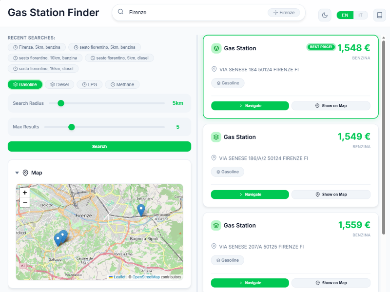

# BenzoApp User Guide

**Version 1.0** | Last Updated: February 2025

---

## Introduction

Welcome to **BenzoApp**, your comprehensive tool for finding and comparing fuel prices at gas stations across Italy. Whether you're looking for the cheapest gasoline in your city or planning a road trip, BenzoApp helps you make informed decisions and save money on fuel.

BenzoApp provides real-time fuel price data from official sources, displayed through an intuitive interface with interactive maps and smart filtering options.

### Main View

*Figure 1: The main interface of BenzoApp showing the search input, filters, and interactive map*

---

## Key Features

### 🗺️ Interactive Map

- View all gas stations on an interactive map powered by Leaflet
- Click markers to see station details and prices
- Automatic map centering on search results
- Zoom and pan controls for detailed exploration

### 🔍 Smart Search

- Search by any Italian city name
- Adjustable search radius (1-200 km)
- Filter by fuel type: Benzina, Gasolio, GPL, Metano
- Limit results to show only the most relevant stations

### 💰 Price Comparison

- Compare prices across multiple stations
- See prices displayed in Italian format (€/liter)
- Identify the best deals at a glance
- View distance from search location

### 🌐 Multi-Language Support

- Full Italian and English interface
- Seamless language switching
- Localized fuel type names and measurements

### 🎨 Modern User Experience

- Dark and light theme options
- Responsive design for desktop and mobile
- Fast, asynchronous search with loading indicators
- Recent search history for quick access

---

## Getting Started

### Opening the Application

1. Launch your web browser
2. Navigate to the BenzoApp URL (typically `http://127.0.0.1:8000`)
3. The application will load with the search interface

### System Requirements

- Modern web browser (Chrome, Firefox, Safari, Edge)
- Internet connection for real-time data
- JavaScript enabled
- No installation required - runs entirely in your browser

---

## Using BenzoApp

### 1. Searching for Gas Stations

#### Basic Search

1. **Enter a city name** in the search field
   - Start typing to see city suggestions
   - Select from the dropdown or type the full name
   - Examples: "Roma", "Milano", "Napoli", "Torino"

2. **Adjust search parameters** (optional):
   - **Radius**: Drag the slider to set search distance (1-200 km)
   - **Fuel Type**: Select your fuel preference from the dropdown
     - Benzina (Gasoline)
     - Gasolio (Diesel)
     - GPL (LPG)
     - Metano (Methane)
   - **Results**: Choose how many stations to display (1-20)

3. **Click "Cerca" (Search)** or press Enter
   - Wait for the loading indicator
   - Results will appear on the map and in the results panel

#### Search Tips

- **City Names**: Use Italian city names for best results. The app supports both official and common local names.
- **Radius**: Smaller radii (5-10 km) are faster and show nearby stations. Larger radii (50+ km) are useful for road trip planning.
- **Fuel Type**: If you select a specific fuel, only stations offering that fuel will be shown.
- **Results Limit**: Lower numbers show only the closest/best matches. Higher numbers provide more options but may include stations further away.

### 2. Understanding Search Results

#### Results Panel

The results panel displays each gas station with:

- **Station Name/Manager** (if available)
- **Address**: Full street address
- **Distance**: How far the station is from your search location
- **Fuel Prices**: Current prices for available fuel types
- **Price Format**: All prices shown as €/liter with 3 decimal places

#### Map Markers

- **Blue markers**: Indicate gas station locations
- **Click a marker** to see a popup with station details
- **Multiple markers** cluster when zoomed out
- **Map automatically adjusts** to show all results

#### Best Price Highlight

The station offering the lowest price for your selected fuel type is marked with a "Miglior Prezzo!" (Best Price!) badge.

### 3. Interacting with the Map

#### Navigation

- **Zoom**: Use the + and - buttons or scroll wheel
- **Pan**: Click and drag to move the map
- **Fit All Results**: The map automatically zooms to show all stations

#### Station Information

- **Click any marker** to open a popup with:
  - Station address
  - All available fuel prices
  - Exact coordinates

#### Map Controls

- **Toggle Fullscreen**: Click the fullscreen button (if available)
- **Layer Selection**: Switch between map view styles (if enabled)

### 4. Additional Actions

#### Navigate to a Station

1. Find the station you want to visit
2. Click "Naviga" (Navigate) button
3. Your default maps application will open with directions

#### Show on Map

If a station is not visible on the current map view:

1. Click "Mostra sulla Mappa" (Show on Map)
2. The map will center on that station

### 5. Managing Preferences

#### Theme Switching

Toggle between dark and light themes:

- Click the **theme toggle button** in the header
- The app remembers your preference for future visits
- System preference is detected on first use

#### Language Selection

Switch between Italian and English:

- Click the **language button** in the header
- All interface text updates immediately
- Your choice is saved automatically

#### Recent Searches

View your recent search history:

- Recent searches appear in the sidebar
- Click any recent search to repeat it
- The last 5 searches are saved
- Clear history by reloading the page

---

## Understanding Fuel Types

| Fuel Type | Italian Name | Description |
|-----------|--------------|-------------|
| Gasoline | Benzina | Standard unleaded gasoline |
| Diesel | Gasolio | Diesel fuel for cars and trucks |
| LPG | GPL | Liquefied Petroleum Gas (Autogas) |
| Methane | Metano | Compressed Natural Gas (CNG) |

**Note**: Not all stations carry all fuel types. Use the fuel filter to show only stations with your preferred fuel.

---

## Tips for Best Results

### Accurate City Search

- Use correct Italian spelling: "Firenze" not "Florence"
- Include province if needed: "Brescia BS"
- For small towns, try the nearest major city

### Optimizing Search Radius

- **Urban areas**: 5-10 km is usually sufficient
- **Rural areas**: 20-50 km may be needed
- **Road trips**: 50-100 km to plan fuel stops
- **Maximum**: 200 km for regional planning

### Reading Prices

- Prices displayed as: `€ 1.850` = €1.850 per liter
- Italian format uses comma as decimal separator in some contexts, but BenzoApp uses standard notation
- Prices are **real-time** but may have slight delays from official sources

### Mobile Usage

- BenzoApp is fully responsive
- Use pinch gestures to zoom on mobile
- Tap markers to view details
- Landscape mode provides more map space

---

## Data Sources and Accuracy

### Official Data

BenzoApp retrieves fuel prices from the **Prezzi Carburante API**, which aggregates data from:

- Italian Ministry of Economic Development
- Regional monitoring networks
- Direct station reports (where required by law)

### Update Frequency

- Prices are updated **daily** by data providers
- Some stations may have more frequent updates
- Weekend prices may reflect Friday's data

### Accuracy Notes

- Prices shown are **retail prices** at the pump
- Prices may vary slightly from what you pay (promotions, membership discounts)
- Some stations may not report data (especially remote locations)
- Always verify prices when critical for budgeting

---

## Troubleshooting

### Common Issues

#### "City not found"

- Check spelling and try alternative names
- Use Italian city names rather than English
- Try a nearby larger city
- Ensure the city is in Italy

#### No results found

- Increase the search radius
- Try a different fuel type
- The city may be in an area with limited reporting stations
- Check your internet connection

#### Slow loading

- Large search radii return more data
- Poor internet connection affects API calls
- Try reducing radius or results count
- Wait a moment for the loading indicator to complete

#### Map not displaying

- Ensure JavaScript is enabled
- Check browser console for errors
- Try refreshing the page
- Verify internet connection for map tiles

### Error Messages

| Message | Meaning | Solution |
|---------|---------|----------|
| "City geocoding service temporarily unavailable" | External API issue | Wait a few minutes and retry |
| "Gas station data temporarily unavailable" | Fuel price API issue | Check connection, retry later |
| "X stations were excluded due to incomplete data" | Some stations missing prices | Results are filtered; try different criteria |

---

## Privacy and Data Usage

### What We Collect

- **Search queries**: City names, radius, fuel type (stored locally only)
- **Recent searches**: Kept in your browser's local storage
- **Theme preference**: Saved locally for your convenience

### What We Don't Collect

- Personal information
- Location data (unless you use city name)
- Browsing history
- Any identifiable information

### Data Storage

- All search history is stored **locally** in your browser
- No data is transmitted to our servers except search queries
- Clear your browser data to remove saved preferences

---

## Keyboard Shortcuts

| Action | Shortcut |
|--------|----------|
| Focus city search | `Ctrl/Cmd + K` |
| Submit search | `Enter` (in search field) |
| Toggle theme | Not assigned |
| Switch language | Not assigned |

*Note: Keyboard shortcuts may be added in future versions.*

---

## Accessibility

BenzoApp is designed with accessibility in mind:

- **Screen reader support** for all interactive elements
- **Keyboard navigation** throughout the interface
- **High contrast** themes for visibility
- **Resizable text** without breaking layout
- **ARIA labels** on all controls
- **Skip links** for quick navigation

If you encounter accessibility issues, please report them.

---

## Frequently Asked Questions (FAQ)

### General

**Q: Is BenzoApp free to use?**
A: Yes, BenzoApp is completely free. We believe in providing accessible tools for everyone.

**Q: How accurate are the fuel prices?**
A: Prices come from official sources and are generally very accurate. However, they are retail prices and may not reflect temporary promotions or membership discounts.

**Q: Can I use BenzoApp outside Italy?**
A: BenzoApp is designed for Italian fuel stations. Searching for non-Italian cities will likely return no results.

**Q: Why are some stations missing prices?**
A: Not all stations report data to the official API, especially in remote areas. Stations with incomplete data are filtered from results.

### Technical

**Q: Does BenzoApp track my location?**
A: No. We only use the city name you enter. We do not access your device's GPS or location services.

**Q: Are my searches logged?**
A: Searches are stored locally in your browser for the recent searches feature. No data is sent to external servers except the search query to retrieve results.

**Q: Can I export my search results?**
A: This feature is not currently available but may be added in future versions.

**Q: Why do I need to enable JavaScript?**
A: BenzoApp is a modern web application that relies on JavaScript for interactivity. It cannot function without JavaScript enabled.

---

## Support and Feedback

### Reporting Issues

If you encounter problems or find bugs:

1. Note the exact error message
2. Record the steps to reproduce
3. Include browser and version information
4. Submit through the project's issue tracker

### Feature Requests

We welcome suggestions! To request a feature:

1. Check if it's already planned
2. Describe the feature and its benefits
3. Explain your use case
4. Submit through the project's channels

### Contributing

BenzoApp is an open-source project. Contributions are welcome:

- Code improvements
- Documentation updates
- Bug fixes
- Translation additions

See the project repository for contribution guidelines.

---

## Credits

### Technologies Used

- **Backend**: FastAPI, Pydantic, httpx, Tenacity, Loguru
- **Frontend**: Alpine.js, Leaflet, i18next
- **APIs**: OpenStreetMap Nominatim, Prezzi Carburante
- **Design**: Custom CSS with Inter font

### Data Providers

- **Geocoding**: OpenStreetMap contributors
- **Fuel Prices**: Italian Ministry of Economic Development

### License

BenzoApp is released under the MIT License. See LICENSE file for details.

---

## Version History

### v1.0.0 (February 2025)

- Initial release
- Core search functionality
- Interactive map integration
- Multi-language support (Italian/English)
- Theme switching (dark/light)
- Responsive design
- Recent search history

---

## Appendix

### Fuel Price Units

All prices in BenzoApp are displayed in:

- **Currency**: Euros (€)
- **Unit**: Per liter (L)
- **Format**: Decimal notation with 3 decimal places (e.g., € 1.850/L)

### Supported Browsers

- Chrome 90+
- Firefox 88+
- Safari 14+
- Edge 90+

### Contact

For questions, support, or contributions, visit the project repository.

---

**Happy fuel hunting with BenzoApp!** 🚗⛽
