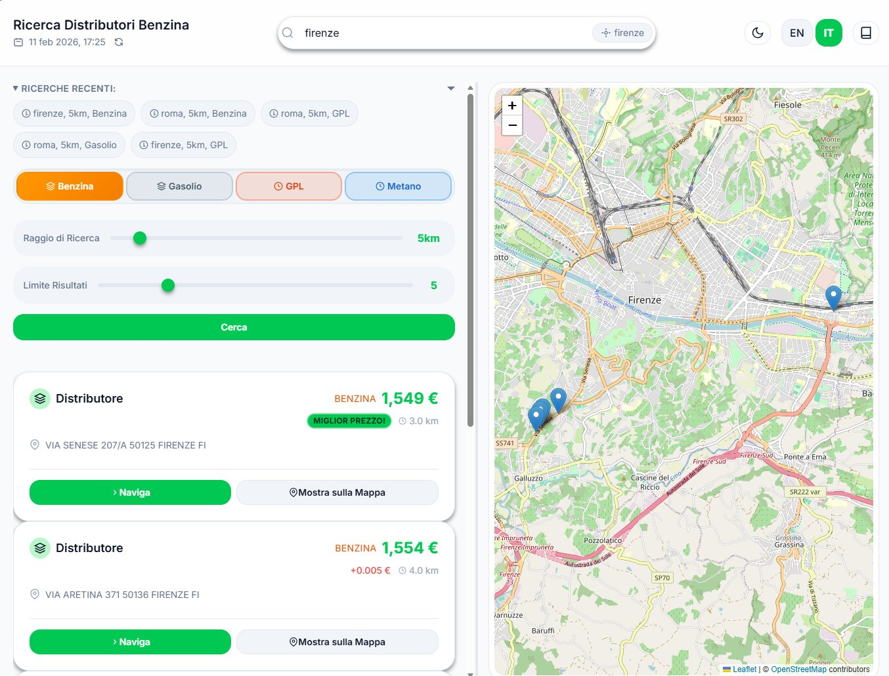

# Guida Utente di BenzoApp

**Versione 1.0** | Ultimo aggiornamento: Febbraio 2025

---

## Introduzione

Benvenuto in **BenzoApp**, il tuo strumento completo per trovare e confrontare i prezzi dei carburanti nelle stazioni di servizio in tutta Italia. Che tu stia cercando la benzina più economica nella tua città o pianificando un viaggio, BenzoApp ti aiuta a prendere decisioni informate e risparmiare sul carburante.

BenzoApp fornisce dati sui prezzi in tempo reale da fonti ufficiali, mostrati attraverso un'interfaccia intuitiva con mappe interattive e opzioni di filtro intelligenti.

### Vista principale

*Figura 1: L'interfaccia principale di BenzoApp che mostra il campo di ricerca, i filtri e la mappa interattiva*

---

## Funzionalità principali

### 🗺️ Mappa interattiva

- Visualizza tutte le stazioni su una mappa interattiva basata su Leaflet
- Clicca sui marker per vedere i dettagli della stazione e i prezzi
- Centratura automatica della mappa sui risultati di ricerca
- Controlli di zoom e pan per esplorare in dettaglio

### 🔍 Ricerca intelligente

- Ricerca per qualsiasi nome di città italiana
- Raggio di ricerca regolabile (1-200 km)
- Filtra per tipo di carburante: Benzina, Gasolio, GPL, Metano
- Limita i risultati per mostrare solo le stazioni più rilevanti

### 💰 Confronto prezzi

- Confronta i prezzi tra più stazioni
- Visualizza i prezzi in formato italiano (€/litro)
- Identifica facilmente le migliori offerte
- Visualizza la distanza dalla posizione di ricerca

### 🌐 Supporto multilingue

- Interfaccia disponibile in italiano e inglese
- Cambio lingua senza ricaricare la pagina
- Nomi dei carburanti e unità localizzati

### 🎨 Esperienza utente moderna

- Opzioni tema scuro e chiaro
- Design responsive per desktop e mobile
- Ricerca asincrona veloce con indicatori di caricamento
- Cronologia delle ricerche recenti per accesso rapido

---

## Come iniziare

### Avvio dell'applicazione

1. Apri il browser web
2. Vai all'URL di BenzoApp (tipicamente `http://127.0.0.1:8000`)
3. L'app si caricherà con l'interfaccia di ricerca

### Requisiti di sistema

- Browser web moderno (Chrome, Firefox, Safari, Edge)
- Connessione a internet per i dati in tempo reale
- JavaScript abilitato
- Nessuna installazione richiesta - funziona interamente nel browser

---

## Utilizzo di BenzoApp

### 1. Ricerca di stazioni di servizio

#### Ricerca base

1. **Inserisci il nome di una città** nel campo di ricerca
   - Inizia a digitare per vedere i suggerimenti di città
   - Seleziona dal menu a discesa o digita il nome completo
   - Esempi: "Roma", "Milano", "Napoli", "Torino"

2. **Regola i parametri di ricerca** (opzionale):
   - **Raggio**: trascina lo slider per impostare la distanza di ricerca (1-200 km)
   - **Tipo di carburante**: seleziona la tua preferenza
     - Benzina
     - Gasolio
     - GPL
     - Metano
   - **Risultati**: scegli quante stazioni mostrare (1-20)

3. **Clicca "Cerca"** o premi Invio
   - Attendi l'indicatore di caricamento
   - I risultati appariranno sulla mappa e nel pannello dei risultati

#### Consigli per la ricerca

- **Nomi delle città**: usa i nomi italiani per risultati migliori. L'app supporta anche nomi locali comuni.
- **Raggio**: ricerche con raggio piccolo (5-10 km) sono più veloci e mostrano stazioni vicine. Raggi più grandi (50+ km) utili per viaggi.
- **Tipo di carburante**: selezionando un carburante specifico verranno mostrate solo le stazioni che lo offrono.
- **Limite risultati**: numeri più bassi mostrano solo le corrispondenze più vicine o migliori.

### 2. Comprendere i risultati della ricerca

#### Pannello dei risultati

Il pannello dei risultati mostra per ogni stazione:

- **Nome della stazione / gestore** (se disponibile)
- **Indirizzo**: indirizzo completo
- **Distanza**: distanza dalla posizione di ricerca
- **Prezzi dei carburanti**: prezzi correnti per i carburanti disponibili
- **Formato prezzo**: tutti i prezzi mostrati in €/litro con 3 decimali

#### Marker sulla mappa

- **Marker blu**: indicano le stazioni
- **Clic su un marker** per aprire un popup con i dettagli
- **I marker si raggruppano** quando la mappa è zoomata indietro
- **La mappa si adatta automaticamente** per mostrare tutti i risultati

#### Evidenziazione del miglior prezzo

La stazione con il prezzo più basso per il carburante selezionato è contrassegnata con il badge "Miglior Prezzo!".

### 3. Interazione con la mappa

#### Navigazione

- **Zoom**: usa i pulsanti + e - o la rotella del mouse
- **Pan**: clicca e trascina per spostare la mappa
- **Mostra tutti i risultati**: la mappa si adatta automaticamente per visualizzare tutte le stazioni

#### Informazioni sulla stazione

- **Clic su un marker** per aprire un popup con:
  - Indirizzo della stazione
  - Tutti i prezzi disponibili
  - Coordinate esatte

#### Controlli della mappa

- **Schermo intero**: clicca il pulsante fullscreen (se presente)
- **Selezione layer**: passa tra stili di mappa (se abilitato)

### 4. Azioni aggiuntive

#### Naviga verso una stazione

1. Trova la stazione desiderata
2. Clicca il pulsante "Naviga"
3. Si aprirà l'app di mappe predefinita con il percorso

#### Mostra sulla mappa

Se una stazione non è visibile nella vista corrente:

1. Clicca "Mostra sulla Mappa"
2. La mappa si centrerà su quella stazione

### 5. Gestione preferenze

#### Cambio tema

- Attiva/disattiva tema scuro/chiaro dal pulsante nell'header
- L'app ricorda la preferenza per le visite successive
- Alla prima apertura la preferenza di sistema viene rilevata

#### Selezione lingua

- Cambia tra italiano e inglese dal pulsante nell'header
- Tutti i testi dell'interfaccia si aggiornano immediatamente
- La scelta viene salvata automaticamente

#### Ricerche recenti

- Le ricerche recenti appaiono nella sidebar
- Clicca una ricerca recente per ripeterla
- Vengono salvate le ultime 5 ricerche
- Per cancellare la cronologia ricarica la pagina

---

## Comprendere i tipi di carburante

| Tipo di carburante | Nome italiano | Descrizione |
|--------------------|---------------|-------------|
| Gasoline | Benzina | Benzina senza piombo standard |
| Diesel | Gasolio | Carburante diesel per auto e camion |
| LPG | GPL | Gas di petrolio liquefatto (Gpl autogas) |
| Methane | Metano | Gas naturale compresso (CNG) |

**Nota**: non tutte le stazioni forniscono tutti i tipi di carburante. Usa il filtro per mostrare solo le stazioni con il carburante desiderato.

---

## Consigli per risultati migliori

### Ricerca città accurata

- Usa l'ortografia corretta in italiano: "Firenze" invece di "Florence"
- Includi la provincia se necessario: "Brescia BS"
- Per piccoli paesi prova la città maggiore più vicina

### Ottimizzare il raggio di ricerca

- **Aree urbane**: 5-10 km solitamente sufficienti
- **Aree rurali**: 20-50 km potrebbero essere necessari
- **Viaggi**: 50-100 km per pianificare le soste
- **Massimo**: 200 km per pianificazioni regionali

### Lettura dei prezzi

- Prezzi mostrati come: `€ 1.850` = €1.850 al litro
- In contesti italiani la virgola è spesso usata come separatore decimale, ma BenzoApp usa notazione standard con punto
- I prezzi sono **in tempo reale** ma possono avere lievi ritardi rispetto alle fonti ufficiali

### Uso su mobile

- BenzoApp è completamente responsive
- Usa il gesto pinch per zoomare su mobile
- Tocca i marker per visualizzare i dettagli
- La modalità landscape offre più spazio per la mappa

---

## Fonti dati e accuratezza

### Dati ufficiali

BenzoApp recupera i prezzi da **Prezzi Carburante API**, che aggrega dati da:

- Ministero dello Sviluppo Economico
- Reti di monitoraggio regionali
- Segnalazioni dirette delle stazioni (quando richiesto dalla legge)

### Frequenza di aggiornamento

- I prezzi vengono aggiornati **giornalmente** dalle fonti dati
- Alcune stazioni possono aggiornare più frequentemente
- I prezzi del weekend possono riflettere i dati del venerdì

### Note sull'accuratezza

- I prezzi mostrati sono **prezzi al dettaglio** alla pompa
- Possono esserci piccole discrepanze dovute a promozioni o sconti per soci
- Alcune stazioni potrebbero non segnalare i dati (soprattutto in aree remote)
- Le stazioni con dati incompleti possono essere escluse dai risultati

---

## Risoluzione dei problemi

### Problemi comuni

#### "Città non trovata"

- Controlla l'ortografia e prova nomi alternativi
- Usa il nome italiano della città
- Prova una città più grande vicino
- Verifica che la città sia in Italia

#### Nessun risultato

- Aumenta il raggio di ricerca
- Prova un altro tipo di carburante
- La città potrebbe avere pochi report dalle stazioni
- Controlla la connessione internet

#### Caricamento lento

- Raggi di ricerca grandi restituiscono più dati
- Connessione internet lenta rallenta le chiamate API
- Riduci il raggio o il numero di risultati
- Attendi il completamento dell'indicatore di caricamento

#### Mappa non visualizzata

- Assicurati che JavaScript sia abilitato
- Verifica la console del browser per errori
- Ricarica la pagina
- Verifica la connessione ai tile della mappa

### Messaggi di errore

| Messaggio | Significato | Soluzione |
|-----------|------------|-----------|
| "Servizio di geocoding temporaneamente non disponibile" | Problema con l'API esterna | Attendi qualche minuto e riprova |
| "Dati delle stazioni temporaneamente non disponibili" | Problema con l'API prezzi | Controlla la connessione e riprova più tardi |
| "X stazioni escluse per dati incompleti" | Alcune stazioni non hanno prezzi | Prova criteri diversi |

---

## Privacy e utilizzo dei dati

### Cosa raccogliamo

- **Query di ricerca**: nomi delle città, raggio, tipo di carburante (memorizzati localmente)
- **Ricerche recenti**: salvate nel browser
- **Preferenza tema**: salvata localmente per comodità

### Cosa non raccogliamo

- Informazioni personali
- Dati di localizzazione (a meno che non venga fornito il nome della città)
- Cronologia di navigazione
- Qualsiasi informazione identificabile

### Conservazione dei dati

- La cronologia delle ricerche è memorizzata **localmente** nel browser
- Nessun dato personale viene inviato ai nostri server, eccetto le query necessarie per ottenere i risultati
- Per rimuovere le preferenze, cancella i dati del browser

---

## Scorciatoie da tastiera

| Azione | Scorciatoia |
|--------|------------|
| Focalizza ricerca città | `Ctrl/Cmd + K` |
| Invia ricerca | `Enter` (nel campo di ricerca) |
| Toggle tema | Non assegnata |
| Cambia lingua | Non assegnata |

*Nota: le scorciatoie potrebbero essere aggiunte in versioni future.*

---

## Accessibilità

BenzoApp è progettata tenendo conto dell'accessibilità:

- **Supporto screen reader** per tutti gli elementi interattivi
- **Navigazione da tastiera** completa
- **Temi ad alto contrasto** per migliore leggibilità
- **Testo ridimensionabile** senza rompere il layout
- **Etichette ARIA** su tutti i controlli
- **Link "salta"** per navigazione rapida

Segnala eventuali problemi di accessibilità.

---

## Domande frequenti (FAQ)

### Generali

**D: BenzoApp è gratuita?**
R: Sì, BenzoApp è completamente gratuita.

**D: Quanto sono accurati i prezzi?**
R: I prezzi provengono da fonti ufficiali e sono generalmente accurati, ma possono non riflettere promozioni temporanee.

**D: Posso usare BenzoApp fuori dall'Italia?**
R: BenzoApp è progettata per stazioni italiane. Ricerche per città non italiane potrebbero non restituire risultati.

**D: Perché mancano alcuni prezzi?**
R: Non tutte le stazioni inviano i dati all'API ufficiale, specialmente in zone remote. Le stazioni con dati incompleti sono filtrate.

### Tecniche

**D: BenzoApp tracca la mia posizione?**
R: No. Usando il nome della città non viene usata la posizione GPS del dispositivo.

**D: Le mie ricerche vengono registrate?**
R: Le ricerche recenti sono salvate localmente nel browser, non vengono inviate ai server.

**D: Posso esportare i risultati?**
R: Funzionalità non disponibile al momento, potrebbe essere aggiunta in futuro.

**D: Perché devo abilitare JavaScript?**
R: BenzoApp è un'app moderna che usa JavaScript per l'interattività; senza JavaScript non funziona.

---

## Supporto e feedback

### Segnalare problemi

1. Annota il messaggio di errore esatto
2. Registra i passaggi per riprodurre il problema
3. Includi browser e versione
4. Invia la segnalazione tramite il tracker del progetto

### Richieste di funzionalità

1. Controlla se è già pianificata
2. Descrivi la funzionalità e i vantaggi
3. Spiega il tuo caso d'uso
4. Invia la richiesta tramite i canali del progetto

### Contribuire

BenzoApp è open-source. Sono benvenuti contributi su:

- Miglioramenti del codice
- Aggiornamenti della documentazione
- Correzioni di bug
- Traduzioni aggiuntive

Vedi il repository per le linee guida di contribuzione.

---

## Crediti

### Tecnologie utilizzate

- **Backend**: FastAPI, Pydantic, httpx, Tenacity, Loguru
- **Frontend**: Alpine.js, Leaflet, i18next
- **API**: OpenStreetMap Nominatim, Prezzi Carburante
- **Design**: CSS personalizzato con font Inter

### Fornitori dati

- **Geocoding**: contributori OpenStreetMap
- **Prezzi carburante**: Ministero dello Sviluppo Economico

### Licenza

BenzoApp è rilasciata sotto licenza MIT. Vedi il file LICENSE per i dettagli.

---

## Cronologia versioni

### v1.0.0 (Febbraio 2025)

- Rilascio iniziale
- Funzionalità di ricerca principali
- Integrazione mappa interattiva
- Supporto multilingue (It/En)
- Cambio tema (scuro/chiaro)
- Design responsive
- Cronologia ricerche recenti

---

## Appendice

### Unità dei prezzi

Tutti i prezzi in BenzoApp sono mostrati in:

- **Valuta**: Euro (€)
- **Unità**: per litro (L)
- **Formato**: notazione decimale con 3 decimali (es. € 1.850/L)

### Browser supportati

- Chrome 90+
- Firefox 88+
- Safari 14+
- Edge 90+

### Contatti

Per domande, supporto o contributi, visita il repository del progetto.

---

**Buona caccia al carburante con BenzoApp!** 🚗⛽
